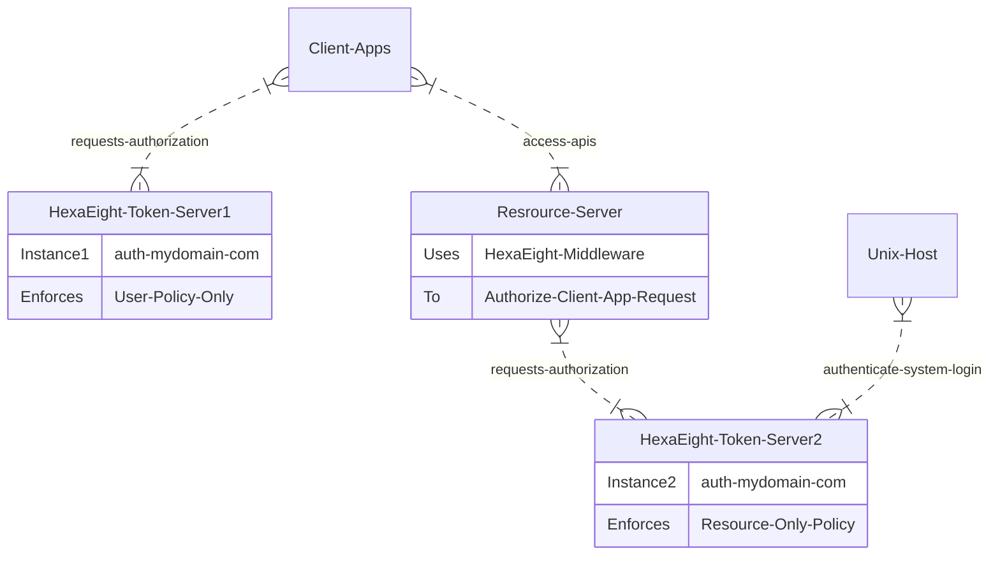

## HexaEight Token Server Authorization

This section contains the authorization files for HexaEight Token Server

#### [Download Sample Policy Zip](https://www.hexaeight.com/downloads/HexaEight_Token_Issuer/policysamples.zip) 

**HexaEight Token Server uses [CASBIN](https://casbin.org/) to enforce authorization. The files are plain text files with the authorization polcies. Hence care should be taken to change the ownership of these files such that no one else except the token server user is allowed to access these files. We will be adding a feature to encrypt these files in our subsequent releses for enhanced protection**

The are totally seven authorization sample files as part of the Zip package.

1. model.conf - This is the default file contains the Model Definition for Enforcement across the rest of the Policy files except Captcha.
2. captchamodel.conf - This file contains the Captcha Model Definition for Enforcement 
3. userpolicy.csv - This Policy file enforces the User Authorization.
4. resourcepolicy.csv - This Policy file enforces the User Authorization.
5. clientappspolicy.csv - This Policy file enforces the authorized Client Applications
6. clientscopespolicy.csv - This Policy file enforces the authorized scope(s) / roles using which the Client Application is allowed to login.
7. captchapolicy.csv - This Policy file enforces Two-Factor-Authentication as well used in enforcing System-Authentication-Plugins

Before you begin modifying these files, you need to prepare some ground work on the authorization policies required for your envionment. 

**HexaEight Token Server supports Split Authorization, which means you can have multiple instances of Token Servers handling different sections of authorizations**

For Example in the below picture, token server auth.mydomain.com has 2 instances running in the Split Authorization mode, where in the first instance only caters to the authorization of frontend application. The resource server connects uses the second instance to request for validating authorization from the client app as well as allowing system authentication for a linux host.  In this scenario both instances of HexaEight token server do not need to talk to each other except that their time code neds to be syncd once during setup. 

Split Authorization allows you to scale your authorization beyond a single server into clusters of authorization segments spanning across different regions.



---

### Authorization Policy Groundwork

If you have the answers to the below authorization questions, you will be in a postion to modify the authorization policy files using a simple text editor to suit your requirement.

The model.conf and captchamodel.conf is a global configuration do NOT require any changes.

### 1. Who are the email users allowed to Login To Your Client Application Through the Token Server and with whom are they authorized to communicate? 
Associated Client Application Policy File Names : userpolicy.csv, captchapolicy.csv, clientscopespolicy.csv, clientappspolicy.csv

### 2. Which Resource Servers are allowed to login Through The Token Server and with whom are they authorized to communicate?
Associated Resource Server Policy File Names : resourcepolicy.csv, clientscopespolicy.csv, clientappspolicy.csv

### 3. What are the list of hosts where HexaEight system authentication will be enabled ? 
Associated Resource Server Policy File Names : resourcepolicy.csv, captchapolicy.csv

---

RBAC: If you wish to implement Role based authorization for your logged in user, clientscopespolicy.csv can be used to define the different roles that the user can use to login to the application. Once the Client application is authenticated, any request to the Resource server will carry the role information that is used to login to the request.

The role can also be substituted as a set of Scopes that can be mapped by the Resource server before granting access to the resource.

---

The clientappspolicy.csv contains a list of authorized Client Applications by using their SHA512 hash. If you are adding a client application hosted on myapp.mydomain.com and your url is http://myapp.mydomain.com:8080/index.html, then you can [use this site to calculate your hash](https://passwordsgenerator.net/sha512-hash-generator/). For this example you will need to use myapp.mydomain.com:8080 to compute the Cient Application hash which in this case is 5CB6AB6D1DC04DA24255C828D0310A2102F03A35F48CD2B7DA96C3A83632A55A220B7B8698E3D318B6B5929BD4165EDF8E0D53CF543B5E522305BF0BEFF2081F.

When using Client SHA512 hashes ensure its entered in capitals, since we have found that lowercase has given some mild enforcement issues.

---

### Additional Information

1. Currently System-Authentiation-Plugin works for Linux and Raspberry pi using PAM authentication, Windows and MacOs System Plugin will be available soon)
2. If you are using Split Authorization, you need to make sure all instances of HexaEight Token Server are using the same copy of  clientscopepolicy.csv and clientappspolicy.csv since this policy file is required for both Client Application authorization as well as Resource authorization
3. Edit the Policy files using any text editor and save these files into the same tokenserver directory where HexaEight Token Server is installed
4. Token Server has the capability to save the configuration files and point to a S3 Storage.  Use the flags --saveconfig and --getconfig to save and retrieve the configuration files from S3 Storage. Below is a sample output

```
HexaEight_Token_Issuer.exe --saveconfig
- Model Configuration Saved Successfully.
- User Policy Configuration Saved Successfully.
- Resource Policy Configuration Saved Successfully.
- Client App Policy Configuration Saved Successfully.
- Client Scopes Policy Configuration Saved Successfully.
- Captcha Model Configuration Saved Successfully.
- Captcha Policy Configuration Saved Successfully.
- Client ID Configuration Saved Successfully.
```
---

### Questions/Bugs
**Use the Issues section, to ask any questions related to authorization policy file any bugs you have encountered during policy enforcement**

### Policy Refernce
The contents of each file with additional information is shown below for quick reference

---
## UserPolicy.csv
```
# User Policy Configuration
# Note: Any Email account is treated as a user.
# This policy defines who is allowed to login (login), request asymmetric shared key (ask) and get information about others (poke)

# ---------------User To TokenServer Policy--------------------------
# The below policy allows any email user  to login to Client
# Application and fetch a Client Token a.k.a asymmetric shared key
# as well as fetch information about the token server.
# -------------------------------------------------------------------
#  EMAILUSER  | AUTHSERVER    | CLIENTAPP | PERMISSION
# -------------------------------------------------------------------
# p, /*@/*./*, mytoken.server, CLIENTID-A, login
# p, /*@/*./*, mytoken.server, CLIENTID-A, ask
# p, /*@/*./*, mytoken.server, CLIENTID-A, poke
# -------------------------------------------------------------------
# p, /*@/*./*, mytoken.server, CLIENTID-B, login
# p, /*@/*./*, mytoken.server, CLIENTID-B, ask
# p, /*@/*./*, mytoken.server, CLIENTID-B, poke
# -------------------------------------------------------------------


# ---------------User To User Policy--------------------------------
# The below policy allows any email address to request a Client Token
# a.k.a asymmetric shared key for any other email address in every
# Client Application.
# -------------------------------------------------------------------
#  SRC-EMAILUSER | DEST-EMAILUSER | CLIENTAPP | PERMISSION
# -------------------------------------------------------------------
# p, /*@/*./*, 	     /*@/*./*,      CLIENTID-A, ask
# p, /*@/*./*, 	     /*@/*./*,      CLIENTID-A, poke
# -------------------------------------------------------------------
# p, /*@/*./*, 	     /*@/*./*,     CLIENTID-B, ask
# p, /*@/*./*, 	     /*@/*./*,     CLIENTID-B, poke
# -------------------------------------------------------------------


# ---------------User To Resource Policy----------------------------
# The below policy allows any email address to request Client Tokens
# to communicate with  other resource servers
# in every  Client Applicatio.
# -------------------------------------------------------------------
#  SRC-EMAILUSER | DEST-RESOURCE | CLIENTAPP | PERMISSION
# -------------------------------------------------------------------
# p, /*@/*./*, myresource.server, CLIENTID-A, ask
# p, /*@/*./*, myresource.server, CLIENTID-A, poke
# p, /*@/*./*, myresource.server, CLIENTID-B, ask
# p, /*@/*./*, myresource.server, CLIENTID-B, poke


# The below policy has a explict deny to block acceess to specific email user or email domains for this realm (Client ID)
# ---------------Global Deny Policy----------------------------------
# The below policy has a explict deny to block acceess for a specific
# Email to another destination Email address or Resource per Client ID
# -------------------------------------------------------------------
#  SRC-EMAILUSER |    DEST-USER/RESOURCE | CLIENTAPP | PERMISSION
# -------------------------------------------------------------------
# p,hack@jack.email, mytoken.server, 	    CLIENTID-A, deny
# p,/*@tempr.email, mytoken.server, 	    CLIENTID-A, deny
# p,someone@gmail.com, personal@yahoo.com,  CLIENTID-B, deny
# p,someone@gmail.com, confidential.resource.com, CLIENTID-B, deny

```
---

---
## ResourcePolicy.csv
```
# Resource Policy Configuration

# Any Non Email account is treated as a Resource
# This policy has a two part definition, one set of policies defines, which resources can login to the token server
# The second set of policies define, which users can access to the resource server by requesting asymmetric shared key

# ---------------Resource To TokenServer Policy--------------------------
# The below policy allows specific Resource Servrs to login to Client
# Application and fetch a Client Token a.k.a asymmetric shared key
# as well as fetch information about the token server.
# -------------------------------------------------------------------
#     SRC-RESOURCE |    AUTHSERVER | CLIENTAPP | PERMISSION
# -------------------------------------------------------------------
# p, myresource.server, mytoken.server, CLIENTID-A, login
# p, myresource.server, mytoken.server, CLIENTID-A, ask
# p, myresource.server, mytoken.server, CLIENTID-A, poke
# -------------------------------------------------------------------
# p, myresource.server, mytoken.server, CLIENTID-B, login
# p, myresource.server, mytoken.server, CLIENTID-B, ask
# p, myresource.server, mytoken.server, CLIENTID-B, poke


# ---------------Resource To User Policy-----------------------------
# -------------------------------------------------------------------
#   SRC-RESOURCE |  DEST-EMAILUSER | CLIENTAPP | PERMISSION
# -------------------------------------------------------------------
# p, myresource.server, /*@/*./*,   CLIENTID-A,   ask
# p, myresource.server, /*@/*./*,   CLIENTID-A,   poke
# -------------------------------------------------------------------
# p, myresource.server, /*@/*./*,   CLIENTID-B,   ask
# p, myresource.server, /*@/*./*,   CLIENTID-B,   poke


# ---------------System Authentication Policy------------------------
# -------------------------------------------------------------------
#   EMAILUSER |  DEST-HOST | AUTHSERVER | PERMISSION
# -------------------------------------------------------------------
# p, /*@/*./*, myunix.server, mytoken.server, systemlogin
# p, /*@/*./*, myraspbpi.server, mytoken.server, systemlogin
# -------------------------------------------------------------------

```
---

---
## CaptchaPolicy.csv
```
# Captcha Sample Policy File

# -----------------------------------------------------
# Allow Any Email Address to request for a Captcha
# Denying a captcha for a user might result in the user 
# not being able to complete the login process.
# -----------------------------------------------------
# -------------------------------------------------------------------
#   EMAILUSER | AUTHSERVER | REQUEST | PERMISSION
# -------------------------------------------------------------------
# p, /*@/*./*, mytoken.server, CAPTCHA, enable

# -----------------------------------------------------
# Example of Denying access to specific email address
# -----------------------------------------------------
# -------------------------------------------------------------------
#   EMAILUSER | AUTHSERVER | REQUEST | PERMISSION
# -------------------------------------------------------------------

# p,/*@tempr.email, mytoken.server, CAPTCHA, deny


```
---

---
## ClientAppsPolicy.csv
```
# Client Apps Policy File
# -------------------------------------------------------------------
# This policy file defines which user agent or client app is allowed 
# to request keys from the token server for a particular client ID
# This enforcement is already done by HexaEight Platform during user authentication.
# However this additional policy enforcement at the token server 
# is provided as a second level of enforcement for additional protection.
# During App Development, it is best to not set this enforcement and 
# enable this enforcement in UAT and Production environments.
# -------------------------------------------------------------------
#    CLIENTSHA512HASH 	 | AUTHSERVER | CLIENTAPP | PERMISSION
# -------------------------------------------------------------------

# p, website.host.sha512hash, mytoken.server, CLIENTID, clientaccess
# p, desktopapp.sha512hash, mytoken.server, CLIENTID, clientaccess
# p, mobileapp.sha512hash, mytoken.server, CLIENTID, clientaccess
# p, scriptapp.sha512hash, mytoken.server, CLIENTID, clientaccess
```
---

---
## ClientScopesPolicy.csv
```
# Client Scopes Policy File

# This policy file defines the Scopes that any email user is allowed to request while login using the Client Application.
# If no scope is requested the DEFAULT scopes is assigned to the Client Application.

# Any Scopes defined here can be used while implementing distributed authorization on the Resource Server by creating a Role similar to the SCOPES
# and granting the role access to the user on the Resource Server
# -------------------------------------------------------------------
#    EMAILUSER | CLIENTSHA512HASH | CLIENTAPP | SCOPE(s)/ROLE
# -------------------------------------------------------------------

# p, /*@*./*, website.host.sha512hash, CLIENTID, DEFAULT
# p, /*@*./*, website.host.sha512hash, CLIENTID, WEBUSER
# p, /*@*./*, website.host.sha512hash, CLIENTID, ADMIN

# p, /*@*./*, mobileapp.sha512hash, CLIENTID, DEFAULT
# p, /*@*./*, mobileapp.host.sha512hash, CLIENTID, MOBILEUSER
# p, /*@*./*, mobileapp.host.sha512hash, CLIENTID, ADMIN

# p, /*@*./*, desktop.sha512hash, CLIENTID, DEFAULT
# p, /*@*./*, desktop.host.sha512hash, CLIENTID, DESKTOPUSER
# p, /*@*./*, desktop.host.sha512hash, CLIENTID, ADMIN

```
---


